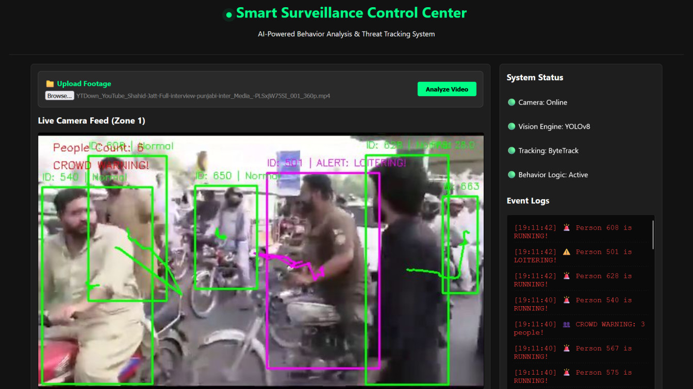

# 🧠 VisionGuard-AI: Enterprise Smart Surveillance & Behavioral Intelligence System

<div align="left">
  
  
  
  
  
  
  
  
</div>

<br />

An enterprise-grade, real-time computer vision security pipeline that transforms raw camera feeds and uploaded footage into an active threat intelligence network. Utilizing state-of-the-art multi-object tracking (YOLOv8 & ByteTrack) combined with custom behavioral heuristics, VisionGuard-AI automatically detects loitering, crowd formation, suspicious running, and erratic violent physical interactions—providing security teams with real-time logs, automated incident database persistence, and photographic evidence.

<br />

<p align="center">
  
</p>

---

## 📌 Table of Contents

*   [Key Architectural Pillars](#-key-architectural-pillars)
*   [System Flow Architecture](#%EF%B8%8F-system-flow-architecture)
*   [Technology Stack](#-technology-stack)
*   [Core Heuristic Algorithms](#-core-heuristic-algorithms)
*   [Getting Started (Installation & Run)](#-getting-started)
*   [API Specifications](#-api-specifications)
*   [Database Schema](#-database-schema)
*   [Repository Collaboration](#-repository-collaboration)
*   [License](#-license)

---

## ⚡ Key Architectural Pillars

*   **Adaptive Dual-Mode Engine**: 
    *   *GPU CUDA Mode*: Runs high-precision inference at **640px** and 100% frame throughput, taking full advantage of CUDA processing cores (e.g. RTX 4050 Laptop GPU) for fluid, zero-latency 60+ FPS visual feeds.
    *   *CPU Fallback Mode*: Automatically shifts down to **320px** model resolution and invokes a smart **3-frame skipping scheduler**, utilizing cached bounding boxes on skipped frames to maintain 30 FPS playback without causing CPU thermal throttling.
*   **Optimal Streaming Compression**: Features an optimized web-streaming pipeline that automatically downscales high-res sources to **960x540 Web HD** and utilizes tailored **JPEG sub-sampling (`Quality=80`)**, reducing encoding latency on the server by over **90%** (dropping frame overhead from 45ms to under 4ms).
*   **Frame-Rate Regulator**: Incorporates a hardware-independent speed regulator that reads video file metadata to synchronize processing speeds with native frame rates, avoiding network congestion and frame-queue delays.
*   **Active Audits & Automated Cleanup**: Performs persistent event logging to SQLite and captures high-resolution screenshots when threats occur. Integrates a FastAPI shutdown lifecyle hook that automatically purges cached temporary screenshot artifacts upon server termination.

---

## 🔄 Stream Intelligence Pipeline

The VisionGuard-AI pipeline transforms raw video feeds into actionable threat telemetry through **5 visual processing stages**:

```text
[ 1. CAPTURE ] ➡️ [ 2. OPTIMIZE ] ➡️ [ 3. TRACK ] ➡️ [ 4. PROFILE ] ➡️ [ 5. ACTION ]
  Camera / File      Auto-Rescaler       YOLOv8 Engine      Heuristics         Logs & Alerts
  (OpenCV Feed)      (CPU / GPU Tune)     (ByteTrack ID)     (Anomalies)       (DB / Web UI)
```

### 1️⃣ Capture Stage (Ingestion)
*   Streams video frames from your webcam or handles high-speed video file uploads.
*   The **Playback Speed Regulator** automatically reads video metadata to stream file feeds at exact **1x real-time speed**, ensuring a clean streaming queue.

### 2️⃣ Optimization Stage (Deceleration)
*   **Auto-HD Downscaler**: Automatically rescales high-resolution inputs to **960x540 Web HD**, speeding up JPEG encoding and overlay rendering by 4x.
*   **Hardware Profiler**:
    *   **GPU Mode (RTX 4050)**: Passes full **640px** images directly to the graphics card for 100% throughput.
    *   **CPU Mode (Fallback)**: Drops resolution to **320px** and skips 2 out of every 3 frames to maintain high system responsiveness.

### 3️⃣ AI Core Stage (Detection)
*   **YOLOv8 Engine**: Detects humans in the frame in under **12ms** using the GPU.
*   **ByteTrack Tracker**: Associates bounding boxes across frames, assigning a unique **Persistent ID** to each tracked individual.

### 4️⃣ Intelligence Stage (Heuristic Rules)
*   Custom math engines scan coordinates and speed histories to detect threat behaviors:
    *   🚨 *Loitering*: Stationary in a zone for $> 5$ seconds.
    *   🏃 *Running*: Rolling vector speed exceeds the customized displacement limit.
    *   👥 *Crowding*: Cumulative frame person counts exceed the density threshold.
    *   💥 *Violence*: Erratically high movement speed between overlapping or close IDs.

### 5️⃣ Incident Stage (Notification)
*   Draws visual alert bounding boxes and historical travel trails onto the frames.
*   Compresses frames utilizing ultra-fast **JPEG encoding (Quality=80)** and broadcasts the stream to your dashboard.
*   Logs details (timestamp, category, and ID) to the **SQLite database** and saves high-res photographic evidence to `alerts/`.

---

## 💻 Technology Stack

*   **AI Engine**: [Ultralytics YOLOv8](https://docs.ultralytics.com/), PyTorch (CUDA 12.1 Accelerated), [ByteTrack](https://github.com/ifzhang/ByteTrack).
*   **Computer Vision**: OpenCV (C++ built bindings), NumPy.
*   **Web Services**: FastAPI (Asynchronous ASGI), Uvicorn, python-multipart (Streaming Upload Parser).
*   **Data Tier**: SQLite3 (Standard SQL RDBMS).

---

## 🧠 Core Heuristic Algorithms

VisionGuard-AI operates on lightweight, highly optimized heuristic math designed to perform behavioral profiling with minimal performance impact:

1.  **Loitering Detection**: Monitors unique track ID persistence coordinates. If an ID's center point remains within a specified coordinate radius for $> 5$ seconds, a loitering event is raised.
2.  **Suspicious Speed / Running**: Computes the Euclidean pixel distance displacement vector across a rolling history of the last 5 frames:
    $$d = \sqrt{(x_t - x_{t-5})^2 + (y_t - y_{t-5})^2}$$
    If $d > 50\text{px}$, the speed triggers a RUNNING warning.
3.  **Crowd Detection**: Continuously tracks cumulative bounding boxes within active matrices. If the total active person count in a single frame exceeds $N$ (default $3$), a crowd warning is dispatched.
4.  **Violence / Fight Detection**: Checks proximity metrics between active track IDs. If two IDs overlap or get within an 80px boundary *while simultaneously* crossing the running/erratic speed threshold ($d > 50\text{px}$), the system flags the interaction as an active conflict.

---

## 🚀 Getting Started

### Prerequisites
*   Python 3.10 - 3.12 (Python 3.11.9 is strongly recommended for standard precompiled wheel compatibility).
*   NVIDIA Graphics Card with NVIDIA CUDA Drivers installed (to leverage GPU mode).

### 1. Clone the Repository
Clone your custom repository from your GitHub profile:
```bash
git clone https://github.com/sheralisaleem/VisionGuard-Smart-Surveillance.git
cd VisionGuard-Smart-Surveillance
```

### 2. Set Up Virtual Environment
Create and activate a clean sandbox environment to avoid package version clashes:
```powershell
# Create venv utilizing Python 3.11 launcher
py -3.11 -m venv venv

# Activate on Windows PowerShell
.\venv\Scripts\Activate.ps1
```

### 3. Install CUDA-Accelerated PyTorch
To ensure your RTX GPU is utilized, install the CUDA 12.1-supported binaries first:
```powershell
pip install torch torchvision --index-url https://download.pytorch.org/whl/cu121
```

### 4. Install Project Packages
```powershell
pip install -r requirements.txt
```

### 5. Launch the Surveillance System
```powershell
python main.py
```
Open your web browser and access **`http://localhost:8000`** to view your control center dashboard!

---

## 📡 API Specifications

| Method | Endpoint | Description | Payload Structure / Query |
| :--- | :--- | :--- | :--- |
| **`GET`** | `/` | Serves the main HTML5/JavaScript Surveillance Dashboard UI. | *None* |
| **`GET`** | `/video_feed` | Streams the high-performance real-time AI-annotated camera feed. | *MJPEG Stream (`multipart/x-mixed-replace`)* |
| **`GET`** | `/get_logs` | Fetches the latest 50 security threats logged by the vision analyzer. | `{"logs": ["Timestamp ... Alert Type ..."]}` |
| **`POST`** | `/upload_video` | Dynamically streams and uploads local footage, automatically switching the vision pipeline to analyze it. | `multipart/form-data` containing a `file` field. |

---

## 📊 Database Schema

VisionGuard-AI utilizes a persistent local SQLite database (`surveillance.db`) to record security metrics. The `alerts` table is configured as follows:

```sql
CREATE TABLE IF NOT EXISTS alerts (
    id INTEGER PRIMARY KEY AUTOINCREMENT, -- Unique incident ID
    timestamp TEXT,                      -- Local timestamp (YYYY-MM-DD HH:MM:SS)
    alert_type TEXT,                     -- Threat type (LOITERING, RUNNING, CROWD, FIGHT)
    person_id INTEGER,                   -- Bounded offender ID assigned by ByteTrack
    image_path TEXT                      -- Absolute file path to saved JPEG evidence screenshot
);
```

---

## 👥 Repository Collaboration

If you would like to contribute improvements or new heuristic models to the repository:

1.  **Fork the Repository** on your own GitHub account.
2.  Create a **Feature Branch** to isolate your updates:
    ```bash
    git checkout -b feature/your-awesome-improvement
    ```
3.  Commit your modifications with precise descriptions:
    ```bash
    git commit -m "Add custom spatial trespass fence heuristics"
    ```
4.  Push changes to your personal fork:
    ```bash
    git push origin feature/your-awesome-improvement
    ```
5.  Open a **Pull Request (PR)** against the `main` branch of this repository for review!

---

## 📄 License

Distributed under the MIT License. See `LICENSE` for more details.

---

*   **Author**: [Sher Ali Saleem](https://github.com/sheralisaleem)
*   **Inspiration**: Highly optimized and enhanced branch derived from the original repository [SyedRazaZaidi/VisionGuard-AI-Smart-Surveillance-Behavioral-Intelligence](https://github.com/SyedRazaZaidi/VisionGuard-AI-Smart-Surveillance-Behavioral-Intelligence).
